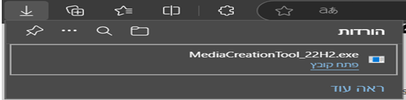

Windows-10-with-apps-pre-installed
<!DOCTYPE html>
<html lang="en">
<head>
    <meta charset="UTF-8">
    <meta name="viewport" content="width=device-width, initial-scale=1.0">
    <!-- <title>Document</title> -->
</head>
<body>

In this guide we install windows 10 with apps pre installed of your choose

*note after this guide you create a custom windows 10 contain on version apps your choose with to install.

This guide was inspired by video: https://www.youtube.com/watch?v=81yIxQ1RdiM

We use virtual machine in this guide

Check that virtualization is enabled in the bios on your computer <a href="https://www.isumsoft.com/computer-tweaks/enable-virtualization-technology-vt-x-in-bios-or-uefi.html">enabled virtualization on bios</a>

<a href="https://www.technewstoday.com/how-to-enable-virtualization-in-bios/">Check enabled virtualization on bios</a>
<h2>Software you need</h2>
<h2>Download according to you'r pc and os</h2>
<h2>virtual machine</h2>

virtualbox <a href="https://www.oracle.com/virtualization/technologies/vm/downloads/virtualbox-downloads.html">virtualbox</a>

 
vmware <a href="https://knowledge.broadcom.com/external/article/309355/downloading-and-installing-vmware-workst.html">vmware</a>

<h2>windows 10</h2>

windows 10 <a href="https://www.microsoft.com/en-us/software-download/windows10?msockid=017162c851b66f9e00e271f850266e87">windows 10</a>

<h2>windows pe</h2>

hirens boot cd <a href="https://www.hirensbootcd.org/download/">hirens boot cd</a>

WinPE10 8 Sergei Strelec <a href="https://sergeistrelec.name/winpe-10-8-sergei-strelec-english/241-winpe-11-10-8-sergei-strelec-x86x64native-x86-20240920-english-version.html">WinPE10 8 Sergei Strelec</a>

<h2>Capture windows with apps image</h2>

Gimagex <a href="https://gimagex.software.informer.com/2.0/">Gimagex</a>

ImageX <a href="https://wimlib.net/downloads/index.html">ImageX</a>

Dism use command: dism.exe /capture-image /ImageFile:"D:\install.wim" /CaptureDir:C:\ /Name:win10apps /compress:max

Using dism command guide youtube: https://www.youtube.com/watch?v=-tIO4B8q8sk

<h2>Edit iso</h2>

Imgburn  <a href="https://www.imgburn.com/index.php?act=download">Imgburn</a>

Poweriso <a href="https://www.poweriso.com/download.htm">poweriso</a>

<h2>Extract</h2>

7zip <a href="https://www.7-zip.org/download.html">7zip</a>

winrar <a href="https://www.win-rar.com/download.html?&L=0">winrar</a>

 

I using virtualbox, windows 10 x64, hirens boot cd, Gimagex, Imgburn

I want to install winrar 7zip office for example

This guide create custom windows 10 on windows os

1. Download and Install virtualbox and Imgburn on your pc

2. Download Gimagex and windows 10 iso

Extract Gimagex put the exe file in usb using 7zip or winrar

<h3>How to download windows 10 iso</h3>

Press downloads on Create Windows 10 installation media it download MediaCreationTool.exe

press on MediaCreationTool.exe 2 times to start the program

accept the license agreement: press accept

after this wait a bit then choose from the options present to you the option "Create installation media (USB flash drive, DVD, or ISO) for another PC" then click "next"

in the next window Select the language, architecture (x32/x64/both), and edition of Windows, you want then click "next" then click "ok"

in the next window Select ISO file give it a name and a path/location (where to save it) then click "next"

then the tool will create your ISO file for you

when it finish click finish and it close the MediaCreationTool.exe

guide: <a href="https://support.microsoft.com/en-us/windows/create-an-iso-file-for-windows-10-38547366-1dcb-7afd-1726-9eb222d72705">guide</a>

when the creation of windows iso is finish you see a windows.iso file in the location you choose

3. Create a virtual machine

<h2>create a virtual machine</h2>

start virtual box 2 clicks on virualbox shortcut

press new it create new machine

in the windows that open give name to the machine,
choose were to save it-live it on default on windows is usely on C:\Users\your user\VirtualBox VMs,
don't select iso file we do this later
choose a type:windows
in the version choose windows 10 then click next

in the windows that open choose amount of ram to machine and amount of cpu to machine then click next

in the windows that open choose amount of hdd to machine then click next

don't click on "pre allocate full size"-if you do it it take the amount from you'r physical hdd

now the machine is created

you can edit the machine: right click on the mouse and choose setting beteen the options, cleeck on setting

in setting go to boot make shoore on boot options "optical" and "hard disk" options are marked

move choose optical and move it above hard disk using the arrows then press "ok"

boot options tell the machine the order of boot sequence

optical option boot the machine from cd or iso

hard disk option boot the machine from hard disk

then go to storage

click on the blue disk name empty then click the blue disk from the right

then choose option 2 "choose from a disk file" from the options menu go to the location of windows iso and choose windows iso and fress "ok"

now the blue disk name change from empty to windows.iso

then press "ok" on button of the setting menu -it save you'r changes and exit the setting menu

4. Install windows 10 on virtual box machine

<h2>install windows 10 on virtual box machine</h2>

on the main menu click 2 times on the machine or click 1 times on the machine and click start

the installation program start choose your installation language, time zone, keyboard language then click "next"

after this on the windows that open click the Install now button

after this this on the windows that open you will be prompted to enter the Windows 10 Product Key

you can click on the option that says I don’t have a product key and skip entering product key

after this on the windows that open choose a version to install

i choose windows 10 pro then click "next"

after this on the windows that open accept terms of use mark the option "i accept the license terms" then click "next"

after this on the windows that open click on custom install

update this option upgrade a working windows 10 when it run to ths version

custom install this option install fresh windows on the hard drive

after this on the windows that open choose the hdd to install windows 10 on it then click "next"

after this on the windows that open windows 10 start to install on the hard drive"

when the installation is over the pc automatically restart

now you get a screens to configure the region, keyboard layout and more

guide <a href="https://techwiser.com/how-to-install-windows-10-in-virtualbox/">guide</a>

5. enter default administrator account before create a user

now press ctrl+shift+f3 keys together it enter you to a default administrator account in pre install system- oobe

on administrator account you install the softwares you want

6. install softwares on windows 10

now i show you the control panel before i install any softwares

search control panel on the search bar and click control panel it open a window called control pannell

on control panel you see programs and under it you see uninstall a program click on "uninstall a program"

i install some softwares and show you the control panel after i install any softwares

7. exit default administrator account using system preparation tool

now press on the window system preparation tool on "ok" the windows restart to before you enter default administrator account

what is system preparation tool? explaine in this article https://learn.microsoft.com/en-us/windows-hardware/manufacture/desktop/sysprep--generalize--a-windows-installation?view=windows-11

the system preparation tool is usuly in location: C:/windows/system32/sysprep/sysprep.exe

8. after this turn off the machine

now turn off the machine press x in the windows of the machine then open a menu mark "power off the machine" and press "ok"

9. let's add another hdd to the machine

<h2>add another hdd to the machine</h2>

do this when the machine is off

go to setting of the machine to storage press right click on the mouse on "controller: sata" choose hard disk then press left click on the mouse

choose create new hdd and press "next"

choose vdi between the options

give it a size and press "ok"

choose witch hdd to attach to machine mark it and press choose

inside storage you see the new hdd you created

press "ok" in buton of the setting menu to save you'r changes

10. add windows pe that you download to the cd choose the location the file located

the windows pe i download called HBCD_PE_x64.iso

yours may be different

11. run the machine

12. you see on the screen a massage: press any key to boot from cd or dvd

it appears for a few seconds

press any key on the keyboard

it enter windows pe iso

13. extract Gimagex according to your windows version copy it to a usb

14. connect the usb to the machine

on the up of the machine window you see device press on it press usb and press on your usb

copy the Gimagex from the usb to windows pe

i copy Gimagex to desktop

15. let's copy Gimagex to the new hdd we created

<h2>copy Gimagex to the new hdd we created</h2>

remmber the new hdd we createt not active it not show up on windows pe

to active it press start (windows symbol) stand on this pc with the mouse press right click on the mouse press left on the mouse and on manage

from thier let's press disk management

open a window ask you to configare the disk to mbr or gpt and press "ok"

it depend of your bios what it support

i choose gpt

now i see 2 colors: blue active black not active

color blue windows know this hdd exist

color black windows don't know this hdd exist

now let's go to the unactive hdd-its the new hdd we created

stand on it press right click on the mouse a menu open up

press "new simple volume"

a menu open up give it the default press "next" and to start the proses on the last windows press "finish"

if the proses succseed you see the hdd color change to blue

you can exit disk management

i copy Gimagex to the new hdd we created

16. 2 click on Gimagex.exe

now open a window

<h2>use Gimagex to capture windows 10 files</h2>

You create file.wim in windows it called install.wim

i create the capture file in the second hdd we created

install.wim vs install.esd explained

https://www.reddit.com/r/windows/comments/gtcdci/whats_the_difference_between_esd_and_wim_and/?rdt=51366

https://windowsreport.com/convert-windows-11-install-wim-to-install-esd/#:~:text=The%20ESD%20%28Electronic%20Software%20Download%29%20file%20format%20uses,meaning%20you%20can%20update%2C%20add%2C%20or%20remove%20components.

on capture tag choose a source click browse choose what hdd you want to capture

on capture tag choose a destination click browse choose where to save the capture file and give it a name

capture file extension is .wim

on capture tag in the option tag mark boot, verify

then click on create batton - it create the file.wim

if you want to cancel the catpure click abort batton

when the prosses is finish click close batton

exit the Gimagex.exe

you can check see the file.wim

exit windows pe

copy the file.wim to you'r pc vie a usb

17. create new iso with apss

<h2>create new iso with apss</h2>

run imageburn click 2 times on imageburn

</body>
</html>
